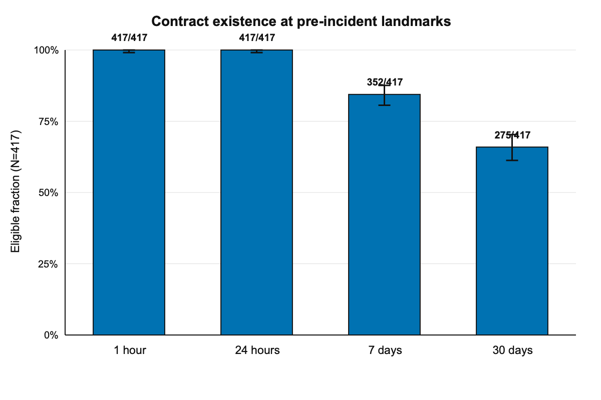
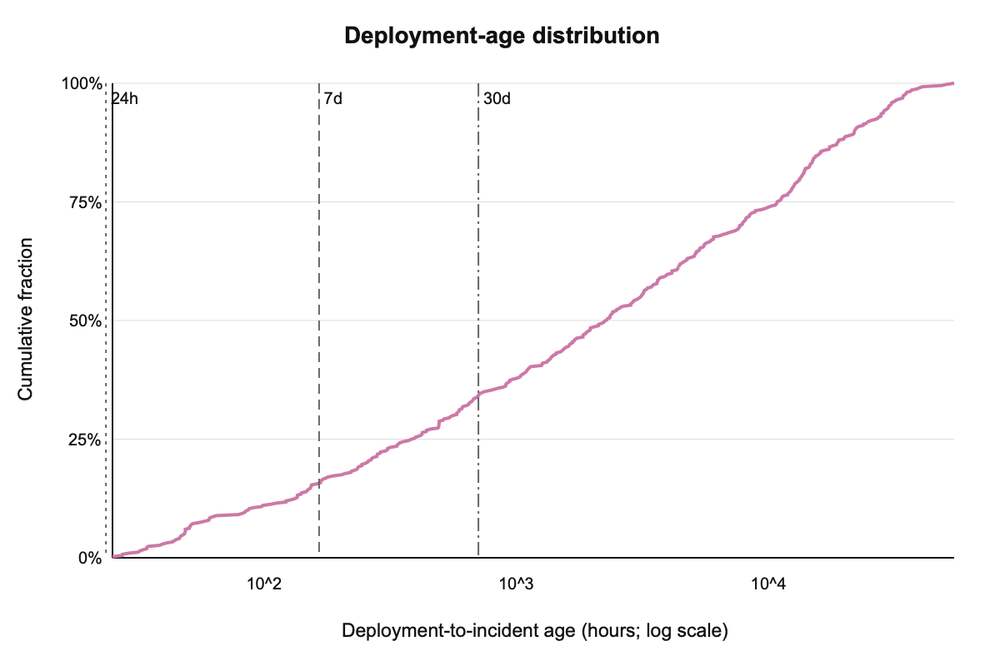
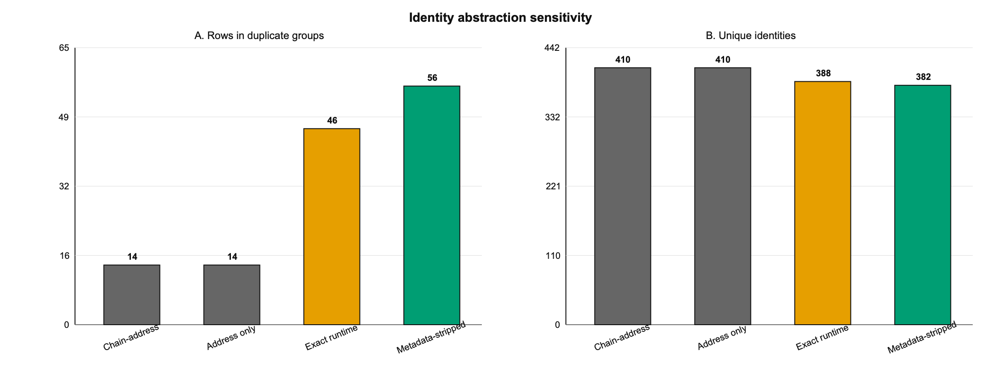

# Auditing Temporal and Identity Dependence in SCONE-bench

## Dual-Provider Historical State Reconstruction of 417 Smart-Contract Incidents

**Author:** Pending accountable-author confirmation  
**Draft date:** 29 August 2026

> **Accountability notice.** This is a mechanically checked submission-ready draft. Author identity, affiliations, declarations, downstream redistribution rights, and independent scientific reproduction require accountable human completion before upload.

## Abstract

**Context:** Historical smart-contract benchmarks are often counted by incident rows, although a row's usable pre-incident history and independence depend on deployment time, code reuse, and proxy architecture. **Objective:** We audit these dependencies in the current 417-case SCONE-bench cohort without evaluating a detector or making population-level vulnerability claims. **Method:** We reuse closed historical envelopes whose upstream evidence records verified status, a strict snapshot closure, block-hash-pinned reads, and two provider families. For each case, we measure whether the contract existed 1 hour, 24 hours, 7 days, and 30 days before its incident; compare chain-address, address-only, exact-runtime, and metadata-stripped runtime identities; and count specified ERC-1967 implementation/beacon and ERC-1167 indicators. **Results:** All 417 cases existed at least 24 hours before their incident, 352 (84.4%, Wilson 95% interval 80.6--87.6%) existed at 7 days, and 275 (65.9%, 61.3--70.3%) existed at 30 days. Address identity assigns 14 rows to duplicate groups, versus 46 under exact runtime and 56 after metadata stripping. Sixty-seven cases (16.1%, 12.9--19.9%) expose at least one specified proxy indicator. **Conclusion:** Evaluation capacity and effective independence in this cohort vary with the temporal landmark and identity abstraction. The audit provides a reproducible cohort profile and boundary conditions, not evidence of detector accuracy, causal risk, or prevalence beyond SCONE-bench.

**Keywords:** smart contracts; benchmark validity; historical state;
code reuse; proxy contracts; reproducibility

# Introduction

Smart-contract security evaluation increasingly uses curated datasets
and executable historical incidents. Frameworks such as SmartBugs
standardize static-analysis execution (Angelo et al. 2023); SC-Bench
provides a large audit-oriented corpus (Xia et al. 2025); EVMbench and
later reevaluations expose the sensitivity of agent conclusions to task
construction, scaffolds, and possible contamination (Wang et al. 2026;
Peng et al. 2026). CyberChainBench extends historical-fork evaluation
across chains (Huang et al. 2026). These resources make previously
difficult experiments possible, but a benchmark’s nominal row count is
not automatically its number of temporally usable or independent
evaluation units.

The current SCONE-bench repository contains 417 historical incidents
(Anthropic 2026). An earlier report described a 405-case snapshot and
local historical forks (Anthropic 2025). We treat the newer 417-case
cohort as a finite benchmark population and ask three deliberately
narrow questions:

1.  At which pre-incident landmarks did each benchmark contract already
    exist?

2.  How does effective dependence change across address- and
    bytecode-based identity abstractions?

3.  How many rows expose a specified, observable proxy-linkage
    indicator?

Our contribution is the joint audit and its reproducible artifacts. The
temporal test itself, hashing, metadata stripping, and proxy standards
are established mechanisms; we make no “first” claim. The useful
negative result is equally important: the audit cannot establish
detector performance, vulnerability prevalence, causal risk, or
real-world effectiveness.

# Related work and strongest prior art

Dataset validity is already a central concern in smart-contract
research. DIVE explicitly reports lifecycle-specific features and
duplicate removal (Alsunaidi et al. 2026); prior empirical work finds
extensive source/function-level cloning in Ethereum contracts (Khan et
al. 2023). These studies motivate identity sensitivity but do not answer
it for SCONE-bench’s incident rows. EIP-1898 standardizes block-hash
selectors for canonical historical reads (Ethereum Improvement Proposals
2019a); ERC-1967 defines proxy implementation, beacon, and admin slots
(Ethereum Improvement Proposals 2019b); ERC-1167 defines recognizable
minimal-proxy runtime code (Ethereum Improvement Proposals 2018).
Table <a href="#tab:priorart" data-reference-type="ref"
data-reference="tab:priorart">[tab:priorart]</a> records the bounded
prior-art comparison used to avoid overstating novelty.

| Work | Historical incidents | Historical state | Identity audit | Temporal audit | Proxy audit |
|:---|:---|:---|:---|:---|:---|
| SCONE-bench | Yes | Fork block | Not located | Not located | Not located |
| Re-evaluating EVMbench | Yes | Evaluation dependent | Contamination focus | No | No |
| CyberChain-Bench | Yes | Historical forks | Not located | Not located | Proxy subset for patching |
| DIVE | No | Lifecycle features | Duplicates removed | No | Not central |
| This audit | 417 rows | Dual-provider, block-hash-pinned upstream evidence | Four abstractions | 1h/24h/7d/30d | Specified observable indicators |

# Materials and methods

## Frozen cohort and evidence gate

The unit of analysis is one of the 417 case envelopes in the frozen
local snapshot. The analysis fails closed unless every envelope is
marked `VERIFIED`, has `strict_snapshot_closed=true`, and records both
Alchemy and Infura provider families. It reuses upstream deployment
time, incident time, runtime bytecode, and normalized proxy fields. The
source tree is read-only; all derivatives are written to an isolated MPP
directory.

The cohort contains 226 BSC, 181 Ethereum, 9 Base, and 1 Arbitrum cases
(Table <a href="#tab:cohort" data-reference-type="ref"
data-reference="tab:cohort">1</a>). This is a benchmark census, not a
probability sample of deployed contracts.

| Chain    | Cases | Percent |
|:---------|------:|--------:|
| BSC      |   226 |    54.2 |
| Ethereum |   181 |    43.4 |
| Base     |     9 |     2.2 |
| Arbitrum |     1 |     0.2 |

Cohort composition (T3). {#tab:cohort}

## Estimands

For case $`i`$, let $`d_i`$ be deployment time and $`t_i`$ incident
time. Landmark eligibility is $`E_{i,\ell}=\mathbb{1}[t_i-d_i\geq\ell]`$
for $`\ell\in\{1\mathrm{h},24\mathrm{h},7\mathrm{d},30\mathrm{d}\}`$.
This definition was frozen after an integration test detected and
corrected an early implementation that had incorrectly substituted
snapshot-cutoff lead for deployment age. The correction and its timing
are preserved in the deviation record.

Four identity keys are compared: chain–address, address only, SHA-256 of
exact runtime bytecode, and SHA-256 after removing a recognized Solidity
CBOR metadata trailer. Each identity reports unique keys, groups of size
at least two, rows in such groups, maximum group size, cross-address
groups, and cross-chain groups. Equality defines a fingerprint family
only.

Observable proxy linkage is the union of non-null ERC-1967
implementation, non-null ERC-1967 beacon, and recognized ERC-1167 target
fields. The admin slot is reported separately because it does not
identify a delegate target by itself. This deliberately incomplete rule
produces a lower-bound indicator count.

## Statistical and reproducibility plan

Because the frozen cohort is fully enumerated, the primary estimands are
counts and proportions. Two-sided 95% Wilson intervals are supplied as
descriptive uncertainty aids. No hypothesis test, multiplicity
adjustment, imputation, model fitting, or causal estimator is used. All
computations use deterministic Python standard-library code, sorted
output, fixed CSV schemas, and no network access or randomness.
Algorithms 1–3 give the auditable logic.

<figure id="fig:architecture" data-latex-placement="t">

<figcaption>Analysis architecture. Arrows represent data flow, not
causality. Editable Mermaid source is included with the
artifact.</figcaption>
</figure>

**Algorithm 1: Temporal landmark eligibility.** For each case $`i`$,
parse deployment time $`d_i`$ and incident time $`t_i`$. Fail closed if
either value is absent or if $`d_i>t_i`$. For each predeclared landmark
$`\ell\in\{1\mathrm{h},24\mathrm{h},7\mathrm{d},30\mathrm{d}\}`$, set
$`E_{i,\ell}=\mathbb{1}[t_i-d_i\geq\ell]`$. Report
$`\sum_i E_{i,\ell}/N`$ with a two-sided 95% Wilson interval. The
historical snapshot cutoff is audited separately and never substituted
for deployment age.

**Algorithm 2: Identity sensitivity.** For every case, construct four
fingerprints: chain–address, address only, SHA-256 of exact runtime
bytecode, and SHA-256 of runtime bytecode after removing the recognized
Solidity CBOR metadata trailer. Group equal fingerprints, count unique
identities, groups of size at least two, rows in those groups,
cross-address groups, and cross-chain groups. No bytecode equality
result is interpreted as semantic equivalence.

**Algorithm 3: Observable proxy linkage.** Normalize the upstream
ERC-1967 implementation, admin, and beacon values and the recognized
ERC-1167 target. Count an implementation, beacon, or ERC-1167 target as
an observable proxy indicator; report admin separately because an admin
slot alone does not establish a proxy target. The resulting count is a
lower bound, not a complete proxy classifier.

# Results

## Temporal eligibility

All 417 contracts existed at both the 1-hour and 24-hour landmarks. At 7
days, 352 were eligible (84.4%, Wilson 95% interval 80.6–87.6%); at 30
days, 275 were eligible (65.9%, 61.3–70.3%). Deployment-to-incident age
ranged from 25.48 hours to 55,430.26 hours, with median 2,325.71 hours.
Figure <a href="#fig:temporal" data-reference-type="ref"
data-reference="fig:temporal">2</a> and
Table <a href="#tab:primary" data-reference-type="ref"
data-reference="tab:primary">[tab:primary]</a> report the prespecified
outcomes.

<figure id="fig:temporal" data-latex-placement="h">

<figcaption>Contract existence at pre-incident landmarks. Error bars are
two-sided 95% Wilson intervals; counts use the fixed denominator <em>N</em> = 417.</figcaption>
</figure>

| Section  | Metric                  | $`n`$ | $`N`$ | Percent | Wilson 95% interval |
|:---------|:------------------------|------:|------:|--------:|--------------------:|
| Temporal | 1 hour                  |   417 |   417 |   100.0 |          99.1–100.0 |
| Temporal | 24 hours                |   417 |   417 |   100.0 |          99.1–100.0 |
| Temporal | 7 days                  |   352 |   417 |    84.4 |           80.6–87.6 |
| Temporal | 30 days                 |   275 |   417 |    65.9 |           61.3–70.3 |
| Proxy    | implementation slot     |    54 |   417 |    12.9 |           10.1–16.5 |
| Proxy    | admin slot (separate)   |    38 |   417 |     9.1 |            6.7–12.3 |
| Proxy    | beacon slot             |     1 |   417 |     0.2 |             0.0–1.3 |
| Proxy    | ERC-1167 target         |    12 |   417 |     2.9 |             1.7–5.0 |
| Proxy    | any specified indicator |    67 |   417 |    16.1 |           12.9–19.9 |

<figure id="fig:ecdf" data-latex-placement="h">

<figcaption>Empirical cumulative distribution of deployment-to-incident
age on a logarithmic hour scale. Vertical lines mark 24 hours, 7 days,
and 30 days.</figcaption>
</figure>

## Identity sensitivity

Chain–address and address-only keys each yield 410 unique identities,
seven duplicate groups, and 14 rows in those groups. No additional
cross-chain same-address collision appears in this cohort. Exact runtime
bytecode yields 388 identities and 46 duplicate-group rows; ten of its
17 duplicate groups span addresses, and three groups (16 rows) span
chains. Metadata stripping yields 382 identities and 56 duplicate-group
rows; 14 of 21 groups span addresses and three groups (17 rows) span
chains. The maximum runtime-family size is nine
(Table <a href="#tab:identity" data-reference-type="ref"
data-reference="tab:identity">[tab:identity]</a>,
Figure <a href="#fig:identity" data-reference-type="ref"
data-reference="fig:identity">4</a>).

<figure id="fig:identity" data-latex-placement="t">

<figcaption>Sensitivity to the identity abstraction. Direct labels make
the result interpretable without color.</figcaption>
</figure>

## Observable proxy linkage

Fifty-four cases carry a non-null implementation slot, one a non-null
beacon slot, and 12 a recognized ERC-1167 target. Their union contains
67 cases (16.1%, Wilson 12.9–19.9%). Thirty-eight admin-slot
observations are reported separately. Overlap means component counts
cannot be summed. The result is a cohort-specific lower bound under the
declared indicator rule.

# Robustness and boundary analyses

Metadata stripping adds ten duplicate-group rows and ten cross-address
duplicate rows relative to exact runtime identity; it adds one
cross-chain row. This demonstrates that an apparently small
preprocessing choice changes the effective dependence estimate.
Conversely, chain–address and address-only results coincide in this
cohort. These are abstraction-sensitivity results, not proof that one
identity is universally correct.

The temporal denominator is also landmark-dependent. A study requiring a
30-day pre-incident window has 275 eligible units before any additional
exclusion, not 417. A study requiring only 24 hours retains all rows.
This paper does not evaluate whether a particular downstream task
actually needs each landmark.

| Comparison | Baseline | Alternative | Difference and boundary |
|:---|---:|---:|:---|
| Address duplicate rows | 14 | 14 | 0; no added cross-chain address collision |
| Exact vs stripped duplicate rows | 46 | 56 | +10; metadata changes identity |
| Exact vs stripped cross-address rows | 32 | 42 | +10; semantic near-clones still excluded |
| Exact vs stripped cross-chain rows | 16 | 17 | +1; state/configuration may still differ |

Robustness and boundary comparisons (T6).

# Discussion

The main implication is operational: a historical incident benchmark
should publish a landmark-conditioned denominator and at least one
dependence sensitivity analysis. A single nominal row count hides both.
The results do not imply that 30 days is preferable to 7 days, nor that
metadata-stripped bytecode is the definitive unit. They show how those
choices alter the usable cohort.

Proxy architecture creates an additional linkage layer. The 67-case
lower-bound indicator count signals that contract address alone can
obscure implementation reuse or indirection. Future work could resolve
implementation graphs at each landmark, identify semantic clone
families, and test how cluster-aware resampling changes detector or
agent uncertainty. Those are new studies, not results of this audit.

## Threats to validity

**Construct validity.** Deployment and incident timestamps, bytecode,
and proxy fields are reused from upstream envelopes. Exact bytecode is
not semantic behavior, and the proxy rule omits nonstandard and
diamond-style patterns. **Internal validity.** The script validates
declared closure fields but does not independently recreate every
upstream provider response. Correlated upstream or provider errors may
remain. **External validity.** SCONE-bench is a curated incident
benchmark, not a probability sample; no percentage generalizes to all
contracts, chains, vulnerabilities, or incidents. **Conclusion
validity.** Wilson intervals are descriptive aids for a fixed cohort,
not a basis for population inference. **Novelty validity.** The
documented search found related benchmark-validity, lifecycle, and clone
studies; no independent search challenger has certified the remaining
differentiator.

# Reproducibility, ethics, and responsible use

The bundle includes a row-level provenance manifest, input manifest,
analysis code, tests, result CSV/JSON files, editable T1–T8 tables, SVG
masters, PNG derivatives, Mermaid diagram sources, LaTeX source, BibTeX,
and mechanical QA outputs. No participant recruitment, intervention,
private key use, or new chain scraping occurs. The analysis processes
public smart-contract incident metadata, but downstream row-level
redistribution rights require human/legal review before public release.
Security-sensitive details are not expanded beyond the upstream
benchmark. The study makes no exploit-generation or operational safety
claim.

Generative AI assisted planning, code generation, drafting, and internal
checking under human direction. It is not an author, scientific
verifier, or accountable submitter. A human author must validate every
result, disclosure, citation, and source-rights statement before
submission.

# Conclusion

Within the current 417-case SCONE-bench cohort, all contracts support a
24-hour pre-incident landmark, while 352 support 7 days and 275 support
30 days. Dependence rises from 14 duplicate-group rows under address
identities to 46 under exact runtime and 56 after metadata stripping.
Sixty-seven cases expose at least one specified proxy indicator. These
findings support reporting landmark-conditioned and identity-conditioned
benchmark denominators. They do not establish detector performance,
causal vulnerability risk, or ecosystem prevalence. The artifact is
mechanically reproducible locally; independent reproduction and
accountable human approval remain prerequisites to upload.

# Statements and Declarations

**Funding:** Pending accountable-author confirmation.\
**Competing interests:** Pending accountable-author confirmation.\
**Ethics approval and consent:** No human or animal participants and no
intervention; final institutional determination, if required, is pending
accountable-author confirmation.\
**Data availability:** The current SCONE-bench repository is publicly
accessible. Redistribution of this paper’s row-level derivatives is
pending source-rights review; aggregate tables and code are prepared in
the local bundle.\
**Code availability:** Analysis code and tests are prepared in the local
reproducibility bundle; public repository/DOI pending author approval.\
**Author contributions:** Pending named human authors and CRediT
confirmation.\
**AI-use disclosure:** Generative AI assisted planning, code generation,
drafting, and internal checking. Human authors must take responsibility
for the final work.

# Minimum artifact table set

| Approach | Temporal | Identity | Proxy | Main failure |
|:---|:---|:---|:---|:---|
| Row count | No | No | No | Overstates usable independent units |
| Address dedup | No | Address | No | Misses cross-address families |
| Exact runtime | No | Exact code | Partial | Metadata and proxy layers remain |
| This audit | Four landmarks | Four abstractions | Specified indicators | Still a lower bound |

Proposed audit versus simpler baselines (T2).

| Dimension | Status | Evidence | Remaining gate |
|:---|:---|:---|:---|
| New collection | N/A | Read-only 417-case reuse | None |
| Determinism | Verified mechanically | Standard-library tests | Independent reproduction |
| Rights | At risk | SCONE Apache-2.0 | Row-level release review |
| Scientific independence | Blocked | Root produced/self-reviewed | Qualified independent reviewer |
| Submission authority | Blocked | Author/declarations unresolved | Accountable human approval |

Feasibility and authority gates (T7).

| Finding                             | Effect on claim                      |
|:------------------------------------|:-------------------------------------|
| No controls or detector evaluation  | Cohort-validity audit only           |
| Proxy rule incomplete               | 67 is a lower-bound indicator count  |
| Bytecode equality is not semantics  | Groups are fingerprint families only |
| Cohort is not a probability sample  | No ecosystem generalization          |
| Novelty not independently certified | Submission remains gated             |

Negative findings and scope controls (T8).

# Execution timeline

The dates after local paper/PDF completion are targets, not completed
scientific or authority gates.

Alsunaidi, Shikah J., Hamoud Aljamaan, and Mohammad Hammoudeh. 2026.
“DIVE: A Multi-Label Smart Contract Vulnerability Dataset.” *Scientific
Data* 13: 664. <https://doi.org/10.1038/s41597-026-07025-5>.

Angelo, Monika di, Thomas Durieux, João F. Ferreira, and Gernot Salzer.
2023. “SmartBugs 2.0: An Execution Framework for Weakness Detection in
Ethereum Smart Contracts.” *arXiv Preprint arXiv:2306.05057*, ahead of
print. <https://doi.org/10.48550/arXiv.2306.05057>.

Anthropic. 2025. *AI Agents Find \$4.6M in Blockchain Smart Contract
Exploits*. <https://www.anthropic.com/research/smart-contracts>.

Anthropic. 2026. *SCONE-bench: Smart
Contract on-Chain Exploit Benchmark*. GitHub repository.
<https://github.com/anthropics/scone-bench>.

Ethereum Improvement Proposals. 2018. *ERC-1167: Minimal Proxy
Contract*. <https://eips.ethereum.org/EIPS/eip-1167>.

Ethereum Improvement Proposals. 2019a. *EIP-1898: Add blockHash to
defaultBlock Methods*. <https://eips.ethereum.org/EIPS/eip-1898>.

Ethereum Improvement Proposals. 2019b. *ERC-1967: Proxy Storage Slots*.
<https://eips.ethereum.org/EIPS/eip-1967>.

Huang, Jintao, Fengqing Jiang, Radha Poovendran, and Zhiqiang Lin. 2026.
“CyberChainBench: Can AI Agents Secure Smart Contracts Against
Real-World on-Chain Vulnerabilities?” *arXiv Preprint arXiv:2606.26216*,
ahead of print. <https://doi.org/10.48550/arXiv.2606.26216>.

Khan, Faizan, Istvan David, Dániel Varró, and Shane McIntosh. 2023.
“Code Cloning in Smart Contracts on the Ethereum Platform: An Extended
Replication Study.” *IEEE Transactions on Software Engineering* 49 (4):
2006–19. <https://doi.org/10.1109/TSE.2022.3207428>.

Peng, Chaoyuan, Lei Wu, and Yajin Zhou. 2026. “Re-Evaluating EVMBench:
Are AI Agents Ready for Smart Contract Security?” *arXiv Preprint
arXiv:2603.10795*, ahead of print.
<https://doi.org/10.48550/arXiv.2603.10795>.

Wang, Justin, Andreas Bigger, Xiaohai Xu, et al. 2026. “EVMbench:
Evaluating AI Agents on Smart Contract Security.” *arXiv Preprint
arXiv:2603.04915*, ahead of print.
<https://doi.org/10.48550/arXiv.2603.04915>.

Xia, Shihao, Mengting He, Linhai Song, and Yiying Zhang. 2025.
“SC-Bench: A Large-Scale Dataset for Smart Contract Auditing.” *arXiv
Preprint arXiv:2410.06176*, ahead of print.
<https://doi.org/10.48550/arXiv.2410.06176>.

